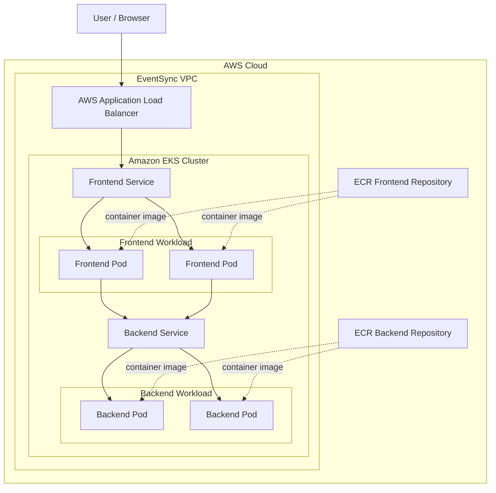
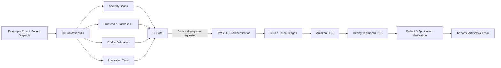

[](https://github.com/youssefrezk1/EventSync-DevOps/actions/workflows/ci-cd.yml)

# EventSync DevOps

**Production-oriented DevOps implementation for EventSync, built with Docker, GitHub Actions, Terraform, AWS, Amazon EKS, Kubernetes, and automated security gates.**

EventSync is a campus-wide events and activities platform originally developed for the German University in Cairo (GUC). This repository focuses on the **DevOps engineering around the application**: containerization, automated testing and security scanning, infrastructure as code, cloud infrastructure, Kubernetes orchestration, continuous deployment, workload hardening, reliability controls, and automated reporting.

> **Project focus:** turning an existing full-stack application into a reproducible, security-conscious, cloud-native deployment workflow.

---

## Table of Contents

- [What This Repository Demonstrates](#what-this-repository-demonstrates)
- [Architecture](#architecture)
- [Technology Stack](#technology-stack)
- [DevOps Journey](#devops-journey)
- [Containerization](#containerization)
- [CI/CD Pipeline](#cicd-pipeline)
- [Infrastructure as Code](#infrastructure-as-code)
- [Kubernetes Architecture](#kubernetes-architecture)
- [Security and Hardening](#security-and-hardening)
- [Availability and Reliability](#availability-and-reliability)
- [Automated Reporting](#automated-reporting)
- [Repository Structure](#repository-structure)
- [Deployment Flow](#deployment-flow)
- [Current Project Status](#current-project-status)
- [Next Phase: Observability](#next-phase-observability)
- [Future Research Direction](#future-research-direction)
- [Engineering Takeaways](#engineering-takeaways)

---

## What This Repository Demonstrates

This project implements an end-to-end DevOps lifecycle around a real full-stack application.

| Area | Implementation |
| --- | --- |
| **Containerization** | Separate frontend and backend Docker images plus Docker Compose integration |
| **Continuous Integration** | Automated frontend/backend validation and integration testing |
| **Security** | Gitleaks, Trivy filesystem/image scanning, dependency auditing, hardened containers and Kubernetes workloads |
| **Infrastructure as Code** | AWS infrastructure provisioned and managed with Terraform |
| **Cloud Platform** | Amazon VPC, ECR, EKS, IAM, OIDC, NAT Gateway and Application Load Balancer integration |
| **Orchestration** | Kubernetes Deployments, Services, Ingress, ConfigMaps, Secrets, NetworkPolicy and PodDisruptionBudgets |
| **Continuous Deployment** | GitHub Actions → AWS OIDC → ECR → Amazon EKS |
| **Reliability** | Multiple replicas, health probes, resource controls, disruption budgets and topology spreading |
| **Reporting** | Workflow artifacts, diagnostics, generated PDF reports and email delivery |

---

## Architecture

### Runtime Architecture



The public entry point is an **internet-facing AWS Application Load Balancer** managed through Kubernetes Ingress. The frontend is exposed through the ALB, while application traffic to the backend is handled internally through Kubernetes services.

The EKS worker nodes run in **private subnets**, while public networking components provide the required external connectivity. Terraform manages the underlying AWS infrastructure.

### CI/CD Architecture



---

## Technology Stack

### Application

- React frontend
- Node.js / Express backend
- MongoDB
- Nginx-based frontend container/proxy

### DevOps and Cloud

- **Docker** — application containerization
- **Docker Compose** — local/integration orchestration
- **GitHub Actions** — CI/CD automation
- **Terraform** — AWS infrastructure as code
- **AWS ECR** — private container registries
- **Amazon EKS** — managed Kubernetes control plane
- **Amazon VPC** — isolated cloud networking
- **AWS IAM** — infrastructure and workload permissions
- **AWS OIDC / STS** — short-lived CI/CD authentication
- **AWS Load Balancer Controller** — Kubernetes-to-ALB integration
- **Kubernetes** — application orchestration
- **Gitleaks** — secret detection
- **Trivy** — filesystem and container vulnerability scanning
- **Dependabot** — automated dependency update checks

---

## DevOps Journey

The repository was developed incrementally rather than as a single infrastructure dump.

```text
Application
    │
    ▼
Containerization
    │
    ▼
CI + Automated Tests
    │
    ▼
Security Scanning
    │
    ▼
Terraform AWS Infrastructure
    │
    ▼
Amazon EKS Deployment
    │
    ▼
Automated Continuous Deployment
    │
    ▼
Unified CI/CD + Reporting
    │
    ▼
Container & Kubernetes Hardening
    │
    ▼
Network Policies + Resource Controls
    │
    ▼
PDBs + Topology Spreading
    │
    ▼
Observability  ← next phase
```

The Git history reflects this progression: CI and security validation were established first, followed by Terraform infrastructure, Kubernetes deployment, ALB integration, AWS OIDC-based CD, unified reporting, container/workload hardening, resource controls, network policy enforcement, Metrics Server management, PodDisruptionBudgets and topology-aware replica placement.

---

## Containerization

The application is split into independent frontend and backend containers.

### Frontend

The frontend image packages the web application behind an Nginx-based runtime and includes a container health check. The frontend also acts as the application-facing proxy for backend traffic in the Kubernetes deployment.

### Backend

The backend is packaged independently so that it can be built, scanned, versioned and deployed separately from the frontend.

### Docker Compose

Docker Compose is used as part of CI to validate the application as an integrated system before cloud deployment.

The integration stage:

1. Builds/starts the application stack.
2. Exercises the running application.
3. Captures container state and application logs.
4. Shuts the environment down with volumes removed.
5. Uploads diagnostics as workflow artifacts.

This provides a deployment gate beyond isolated package-level tests.

---

## CI/CD Pipeline

The repository uses a **unified GitHub Actions pipeline**.

### CI stages

```text
┌─────────────────────────────┐
│       Secret Security       │  Gitleaks
├─────────────────────────────┤
│      Trivy Filesystem       │  HIGH / CRITICAL gate
├─────────────────────────────┤
│         Frontend CI         │  install, lint, build, audit
├─────────────────────────────┤
│          Backend CI         │  install, tests, audit
├─────────────────────────────┤
│       Docker Security       │  build + Trivy image scans
├─────────────────────────────┤
│    Docker Compose Check     │  configuration validation
├─────────────────────────────┤
│      Integration Test       │  full application validation
└──────────────┬──────────────┘
               │
               ▼
        ┌─────────────┐
        │   CI Gate   │
        └──────┬──────┘
               │ success
               ▼
        Optional CD stage
```

The **CI Gate** evaluates all required upstream jobs. Deployment is not allowed to proceed when a required CI stage fails.

### Continuous Deployment

When deployment is requested and the CI gate succeeds, the workflow:

1. Creates an immutable image tag from the Git commit SHA.
2. Authenticates to AWS using **GitHub Actions OIDC**.
3. Logs in to Amazon ECR.
4. Builds and pushes frontend/backend images when required.
5. Configures `kubectl` for the EKS cluster.
6. Verifies the Kubernetes permissions required by the deployment.
7. Applies workload service accounts.
8. Applies NetworkPolicy configuration.
9. Applies PodDisruptionBudgets.
10. Deploys the new backend and frontend image versions.
11. Verifies rollout/application state.
12. Generates deployment and security reports.

### Why OIDC?

The deployment workflow assumes an AWS IAM role using GitHub's OIDC identity token rather than storing permanent AWS access keys in GitHub.

```text
GitHub Actions
      │
      │ OIDC identity token
      ▼
AWS STS / IAM Role
      │
      ├── ECR permissions
      └── EKS deployment access
```

This reduces long-lived credential exposure and allows the CI/CD trust relationship to be constrained to the intended repository/workflow context.

---

## Infrastructure as Code

AWS infrastructure is managed through Terraform.

### Provisioned Infrastructure

The Terraform configuration includes:

- EventSync VPC
- Two public subnets
- Two private subnets
- Internet Gateway
- NAT Gateway and Elastic IP
- Public and private route tables
- Amazon ECR frontend repository
- Amazon ECR backend repository
- Amazon EKS cluster
- EKS managed node group
- EKS/IAM roles and policy attachments
- EKS OIDC provider
- AWS Load Balancer Controller IAM integration
- GitHub Actions deployment IAM integration
- EKS access configuration
- Kubernetes networking-related EKS add-on configuration
- Metrics Server management

### Network Layout

```text
                         Internet
                            │
                    Internet Gateway
                            │
             ┌──────────────┴──────────────┐
             │                             │
       Public Subnet A               Public Subnet B
       us-east-1a                    us-east-1b
             │                             │
             └──────── AWS ALB ────────────┘
             │
         NAT Gateway
             │
      ┌──────┴───────────────────────┐
      │                              │
Private Subnet A                Private Subnet B
us-east-1a                      us-east-1b
      │                              │
      └────── EKS Worker Nodes ──────┘
```

The managed node group uses private subnets across two Availability Zones. Its configured baseline is **two on-demand `t3.small` nodes**, with a maximum size of three.

### ECR

Separate repositories are maintained for frontend and backend images. Image tags are immutable and ECR scan-on-push is enabled.

### Terraform Outputs

The configuration exposes useful deployment outputs including:

- AWS region
- project/environment
- frontend and backend ECR repository URLs
- VPC ID
- public/private subnet IDs
- NAT Gateway ID
- EKS cluster name and endpoint
- managed node group name
- Load Balancer Controller role ARN
- GitHub Actions CD role ARN

---

## Kubernetes Architecture

The application runs in the `eventsync` namespace.

### Workloads

Both application tiers use Kubernetes Deployments:

```text
Frontend Deployment
├── Replica 1
└── Replica 2

Backend Deployment
├── Replica 1
└── Replica 2
```

Each workload is configured with **two replicas**.

### Services

Kubernetes Services provide stable internal networking between application components.

```text
Internet
   │
   ▼
AWS ALB
   │
   ▼
Ingress
   │
   ▼
Frontend Service
   │
   ├── Frontend Pod 1
   └── Frontend Pod 2
            │
            ▼
      Backend Service
            │
            ├── Backend Pod 1
            └── Backend Pod 2
```

### Ingress

The Kubernetes Ingress uses the AWS Load Balancer Controller and requests an:

- internet-facing ALB
- IP target mode
- ALB health check
- HTTP success range of `200-399`

### Configuration

Application configuration is separated from container images using Kubernetes configuration objects where appropriate.

Sensitive values are expected to be handled separately from public repository documentation and are not reproduced in this README.

---

## Security and Hardening

Security is implemented across source control, CI, containers, AWS authentication and Kubernetes.

### Source and Dependency Security

**Gitleaks** scans repository history/content for exposed secrets.

**Trivy** scans:

- repository filesystem
- frontend container image
- backend container image

HIGH and CRITICAL findings are used as security gates for the relevant scans.

Frontend/backend dependency audits are also captured during CI, and Dependabot is configured for recurring dependency checks.

### Container Security

The container hardening work includes measures such as:

- non-root runtime execution
- reduced runtime privileges
- application/container health checks
- remediation of identified application/container vulnerabilities

### Kubernetes Workload Security

Workload manifests include hardened pod/container settings, including:

- dedicated frontend/backend ServiceAccounts
- `automountServiceAccountToken: false` where application workloads do not require Kubernetes API credentials
- `RuntimeDefault` seccomp profile
- explicit resource requests and limits
- NetworkPolicy controls
- health/readiness/liveness behavior
- disruption controls
- topology-aware replica scheduling

### Network Policy

Backend ingress is restricted using Kubernetes NetworkPolicy rather than relying only on application-level assumptions.

### AWS Authentication and IAM

Two important identity patterns are used:

**GitHub Actions → AWS**

```text
GitHub OIDC
    │
    ▼
Deployment IAM Role
    │
    ├── ECR
    └── EKS
```

**AWS Load Balancer Controller → AWS**

```text
Kubernetes ServiceAccount
    │
    ▼
EKS OIDC Provider
    │
    ▼
IAM Role
    │
    ▼
AWS Load Balancer APIs
```

The Load Balancer Controller trust policy is constrained to its Kubernetes service account identity.

---

## Availability and Reliability

The Kubernetes layer includes several controls intended to make application deployment more resilient.

### Multiple Replicas

Both frontend and backend run with two replicas rather than a single application pod.

### Topology Spread Constraints

Replica scheduling uses hostname topology constraints so replicas are spread across worker nodes rather than intentionally concentrating a workload on one node.

The configuration is revision-aware using the pod template hash, helping Kubernetes spread replicas belonging to the same Deployment revision.

### PodDisruptionBudgets

Frontend and backend PodDisruptionBudgets protect workload availability during voluntary disruptions such as node maintenance.

### Resource Requests and Limits

Workloads define CPU/memory requests and limits, improving scheduling predictability and reducing the risk of one container consuming uncontrolled node resources.

### Health Checks

Health/readiness/liveness mechanisms are used so failed or unready workloads can be identified before they receive normal application traffic.

### Metrics Server

Metrics Server is managed as part of the infrastructure configuration, providing Kubernetes resource metrics needed for cluster/workload visibility and future scaling work.

---

## Automated Reporting

A major part of the pipeline is making CI/CD results inspectable after execution.

The workflow collects:

- security scan results
- frontend/backend CI logs
- Docker build diagnostics
- integration-test container state
- integration application logs
- vulnerability data
- deployment results
- failure summaries

Artifacts are retained in GitHub Actions for **30 days**.

The final reporting stage generates consolidated PDF reports, including CI/CD, security and deployment information, and can deliver the reports by email.

```text
Pipeline Results
      │
      ├── Raw diagnostics
      ├── Security data
      ├── Deployment data
      │
      ▼
Report Generation
      │
      ├── CI/CD PDF
      ├── Security PDF
      ├── Deployment PDF
      └── Failure summary
      │
      ├── GitHub Actions artifacts
      └── Email report
```

---

## Repository Structure

```text
EventSync-DevOps/
│
├── .github/
│   ├── workflows/
│   │   └── ci-cd.yml
│   └── dependabot.yml
│
├── app/                         # Frontend application
│   ├── Dockerfile
│   └── ...
│
├── backend/                     # Backend application
│   ├── Dockerfile
│   └── ...
│
├── k8s/                         # Kubernetes manifests
│   ├── backend-configmap.yaml
│   ├── backend-deployment.yaml
│   ├── backend-networkpolicy.yaml
│   ├── backend-pdb.yaml
│   ├── backend-service.yaml
│   ├── backend-serviceaccount.yaml
│   ├── frontend-deployment.yaml
│   ├── frontend-pdb.yaml
│   ├── frontend-service.yaml
│   ├── frontend-serviceaccount.yaml
│   ├── ingress.yaml
│   ├── namespace.yaml
│   └── aws-load-balancer-controller-serviceaccount.yaml
│
├── terraform/                   # AWS infrastructure as code
│   ├── ecr.tf
│   ├── eks.tf
│   ├── iam.tf
│   ├── internet.tf
│   ├── load-balancer-controller-iam.tf
│   ├── locals.tf
│   ├── nat.tf
│   ├── nodegroup.tf
│   ├── oidc.tf
│   ├── outputs.tf
│   ├── provider.tf
│   ├── routes.tf
│   ├── subnets.tf
│   └── ...
│
├── reports/                     # Generated/collected reporting data
├── docker-compose.yaml
└── README.md
```

> The structure above highlights the DevOps-relevant parts of the repository rather than attempting to enumerate every application source file.

---

## Deployment Flow

A successful deployment follows this path:

```text
1. Developer pushes code / starts workflow
                  │
                  ▼
2. GitHub Actions checks out repository
                  │
                  ▼
3. Secret + vulnerability scanning
                  │
                  ▼
4. Frontend/backend validation
                  │
                  ▼
5. Docker build + image security scans
                  │
                  ▼
6. Docker Compose + integration validation
                  │
                  ▼
7. CI Gate
                  │
             PASS │
                  ▼
8. GitHub obtains AWS credentials via OIDC
                  │
                  ▼
9. Images tagged with commit SHA
                  │
                  ▼
10. Images pushed to Amazon ECR
                  │
                  ▼
11. Kubernetes manifests/security controls applied
                  │
                  ▼
12. Frontend/backend Deployments updated
                  │
                  ▼
13. EKS rollout/application verified
                  │
                  ▼
14. Diagnostics + PDF reports generated
                  │
                  ▼
15. Artifacts retained / report email sent
```

This creates traceability between a Git commit, its CI results, container image tag and deployed Kubernetes revision.

---

## Current Project Status

The current DevOps implementation includes:

- [x] Frontend containerization
- [x] Backend containerization
- [x] Docker Compose integration environment
- [x] Unified GitHub Actions CI/CD workflow
- [x] Secret scanning with Gitleaks
- [x] Filesystem vulnerability scanning with Trivy
- [x] Container image vulnerability scanning with Trivy
- [x] Frontend/backend CI
- [x] Integration testing
- [x] CI deployment gate
- [x] Terraform AWS infrastructure
- [x] Amazon ECR repositories
- [x] Amazon EKS cluster and managed worker nodes
- [x] Kubernetes deployments and services
- [x] AWS Application Load Balancer ingress
- [x] GitHub Actions AWS OIDC authentication
- [x] Automated ECR publishing and EKS deployment
- [x] Hardened Kubernetes workload identities
- [x] Kubernetes NetworkPolicy
- [x] Resource requests and limits
- [x] PodDisruptionBudgets
- [x] Topology spread constraints
- [x] Metrics Server management
- [x] Automated diagnostics and PDF/email reporting
- [ ] Centralized logging and observability
- [ ] Monitoring dashboards and alerting

---

## Next Phase: Observability

The next major phase is to add an observability layer around the deployed platform.

Planned areas include:

### Centralized Logging

Evaluate and implement an ELK-style logging architecture:

```text
Application / Kubernetes Logs
             │
             ▼
      Log Collection Layer
             │
             ▼
     Processing / Routing
             │
             ▼
        Elasticsearch
             │
             ▼
           Kibana
```

The goal is to move from workflow-level diagnostics to searchable, centralized runtime logs across the Kubernetes environment.

### Monitoring

The monitoring phase will focus on infrastructure and workload visibility, including areas such as:

- node health
- pod health
- CPU and memory consumption
- deployment availability
- application/service health
- Kubernetes metrics
- alerting
- operational dashboards

The exact monitoring stack will be selected and implemented as part of this phase rather than documented here as already complete.

---

## Future Research Direction

A longer-term idea for this project is an **intelligent log-processing layer** capable of understanding heterogeneous application logs before they reach the indexing pipeline.

The proposed direction is to investigate automatic identification of characteristics such as:

- log format
- application/service source
- structured vs. unstructured messages
- programming/runtime ecosystem
- timestamp and severity conventions

Based on those characteristics, logs could be routed through an appropriate parser or processing pipeline automatically instead of requiring every application to use one manually maintained parsing configuration.

Conceptually:

```text
Incoming Log
     │
     ▼
Format / Source Detection
     │
     ├── JSON ───────────────► JSON Pipeline
     ├── Nginx ──────────────► Web Access Pipeline
     ├── Node.js ────────────► Application Pipeline
     ├── Kubernetes ─────────► Kubernetes Pipeline
     └── Unknown ────────────► Generic / Learned Parser
                                      │
                                      ▼
                               Normalized Event
                                      │
                                      ▼
                                Elasticsearch
```

This is a **planned research direction**, not a feature claimed as implemented in the current repository.

---

## Engineering Takeaways

This project goes beyond deploying an application once. The main engineering objectives are **repeatability, controlled access, security gates, traceability and failure visibility**.

Some of the key design decisions include:

- Infrastructure is defined with Terraform instead of manually reproducing AWS resources.
- CI/CD uses AWS OIDC rather than persistent cloud access keys.
- Container images are independently built, scanned and versioned.
- Deployment occurs only after a consolidated CI gate succeeds.
- ECR tags are immutable, improving image/version traceability.
- Application workloads do not automatically receive Kubernetes API tokens when they do not need them.
- Backend network access is constrained through NetworkPolicy.
- Multiple replicas are combined with disruption budgets and topology spreading instead of treating replica count alone as high availability.
- CI/CD produces diagnostics even when stages fail, improving troubleshooting.
- Reporting is treated as part of the pipeline rather than an afterthought.
- Observability is being developed as a separate engineering phase rather than being presented as complete before implementation.

---

## About EventSync

EventSync is a campus-wide events and activities hub for the German University in Cairo. It brings together students, staff, professors, vendors and the event office to discover, create and manage activities such as workshops, trips, conferences, bazaars, booths and sports events.

The application provides the workload for this repository; **the primary purpose of this repository is the DevOps platform and delivery engineering built around it.**

---

## Author

**Youssef Rezk**

This repository documents the DevOps transformation of EventSync from an application codebase into a containerized, CI/CD-driven, infrastructure-as-code-managed Kubernetes workload on AWS.

---

## License

Refer to the repository's license information, if provided, for usage terms.
